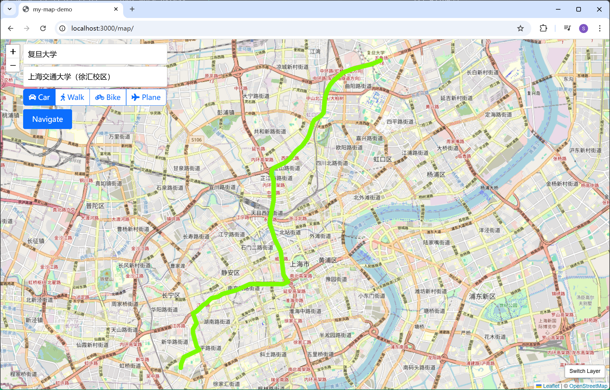

# Data Structure Project

## QuickStart

0. Install dependencies

- Mapnik
- cpp libs
    - jsoncpp
    - rapidfuzz
    - websocketpp
- node js
    - Use `npm install` to install js dependencies used in the project.

1. Pre-render tiles

``` shell
cd ./render
python3 ./main.py
```

2. Build the c++ program. 

``` shell
mkdir build && cd ./build
cmake .. && make
```

3. Start c++ process server and web server.

```shell
./bin/process
node app.js
```

4. Open `http://localhost:3000/map` at browser.


## Milestones

### Basic functions

#### Data Process

- osmium tool

Use osmium tool to convert original `.osm.pbf` file to `.geojson` file which is more convenient to use in leaflet.

- [jsoncpp](https://github.com/open-source-parsers/jsoncpp)

Make it much more handy to process json files in cpp.

#### Shortest Path Algorithm



- [Efficient Point-to-Point Shortest Path Algorithms](https://www.cs.princeton.edu/courses/archive/spr06/cos423/Handouts/EPP%20shortest%20path%20algorithms.pdf)

Correct way to implement bidirectional A* algorithm, which is used in the shortest way calculation.


#### Backend

- [websocketpp](https://github.com/zaphoyd/websocketpp)
- Express: web application framework

#### Frontend

As shown above.

- Leaflet
- Bootstrap

...


### Extra functions

#### Arbitrary points navigation


Right click on the map to select arbitrary points as Start and End.

As shown above, both the start point and end point are selected inside empty rectangles, but navigation succeeds still.

#### Nearest neighbour search with **KD Tree**

Support the arbitrary point navigation. Because an arbitrary point may not be in our graph, we need to find the nearest neighbour as substitute.

#### Different traffic methods


Can choose different traffic methods. (Only <kbd>Car</kbd> and <kbd>Walk</kbd> are available now.)


From `复旦大学` to `杨浦公园`, we get differnt ways using different traffic methods.


(Must choose a method after enter origin and destination. Otherwise, there will be an alert.)

#### Improved real life shortest way algorithm  

When driving a car to travel around, we often take priority of express ways and motor way although it has longer absolute distance. To implement this, roads are classified into different types according to the real life driving speed, which is used in the A* algorithm.

Example is shown in the above section.

#### Fuzzy search 


- [rapidfuzz](https://github.com/rapidfuzz/rapidfuzz-cpp)

It is really annoying to enter the exact full name of a place each time. Therefore, fuzzy search is available. Just type in part of the name and there will pop up some potential place name to choose.


#### Rendering own tiles 


As required, I have rendered my own tiles to use in leaflet. Mapnik is really a handy tool to render tiles from original data. There is a `Switch Layer` button at the right bottom corner that switches between my own layers and openstreetmap layers.

(There are still some problems with polygon rendering, so they are removed currently.)

## Conclusion

This project demonstrated the practical application of data structures and algorithms in building a functional navigation system. Using `osmium-tool` and `jsoncpp`, map data was processed for efficient integration with Leaflet, while a bidirectional A* algorithm enabled accurate and optimized shortest path calculations, enhanced with real-life road classifications. Backend communication leveraged `websocketpp` and Express, seamlessly connecting a C++ backend with a responsive frontend. Key features include arbitrary point navigation supported by KD Tree nearest-neighbor search, fuzzy search with `rapidfuzz`, and customizable traffic methods. Additionally, custom tiles rendered using Mapnik enriched the mapping experience. Despite challenges like polygon rendering, the project effectively combines multiple technologies, offering a robust foundation for real-world navigation solutions.
